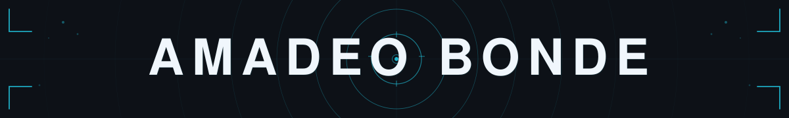
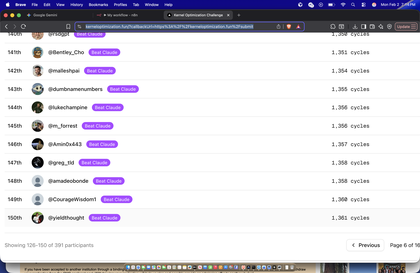
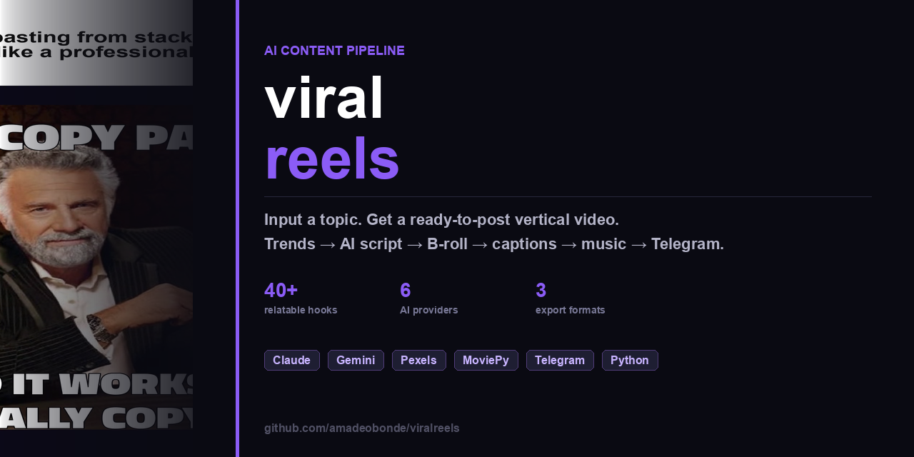

  

<h4 align="center">Hardware × Software &nbsp;·&nbsp; NVMe Inference &nbsp;·&nbsp; iOS + AI &nbsp;·&nbsp; Automation</h4>

  Building highly-optimized, resource-efficient systems in Bergen County, NJ. 
  Accelerating development cycles using <b>Cursor</b>, <b>Claude 3.5 Sonnet</b>, and <b>Copilot</b>.

  
  &nbsp;·&nbsp;
  

 

  

---

 

**[anthropic-kernel-challenge](https://github.com/amadeobonde/anthropic-kernel-challenge)**

Optimized Anthropic's VLIW SIMD scheduler to **1,358 cycles** — rank 148 of 391, beating Claude Opus 4.5 (1,363). Approach: DAG-based instruction scheduling, WAR hazard elimination, vectorized SIMD batching.

`C++` &nbsp; `CUDA` &nbsp; `SIMD`

 

---

 

**[HerbLens](https://github.com/amadeobonde/HerbLens)**

iOS plant ID app — photograph a herb, get instant identification, health scoring against your goals, contraindication warnings, and step-by-step tea & tincture recipes. iOS 26 Liquid Glass UI, RevenueCat paywall.

`Swift` &nbsp; `SwiftUI` &nbsp; `Supabase` &nbsp; `Gemini`

 

---

 

**[viralreels](https://github.com/amadeobonde/viralreels)**

AI comedy reel pipeline — generates viral short-form content end-to-end: Claude/Gemini scripts, ElevenLabs TTS, Pexels B-roll, MoviePy assembly, quality gate, 3-format export, and Telegram review bot. Built to study AI-driven content creation and social media growth at scale.

`Python` &nbsp; `MoviePy` &nbsp; `Gemini` &nbsp; `ElevenLabs`

 

---

 

**[jetson-inference](https://github.com/amadeobonde/jetson-inference)**

LLM inference engine for Jetson Orin Nano. Streams quantized model weights off NVMe directly to GPU via `io_uring` zero-copy I/O — no full-model RAM load. Custom CUDA kernels, sparse FFN with activation prediction cuts I/O ~60%.

`C++` &nbsp; `CUDA` &nbsp; `Python` &nbsp; `io_uring`

---

 

**[podcastbrief](https://github.com/amadeobonde/podcastbrief)**

Spotify playlist → morning-brief PDFs + an Obsidian-style notes vault you can query over Telegram. Whisper transcription, local Gemma 4 via Ollama — zero cloud API cost after setup. Includes a React/TypeScript frontend dashboard.

`Python` &nbsp; `TypeScript` &nbsp; `React` &nbsp; `Ollama` &nbsp; `Whisper`

---

  

