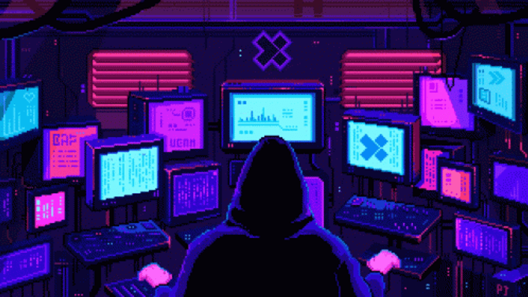

  

<h1 align="center">amadeo bonde</h1>

  I build things at the intersection of hardware and software — 
  custom inference engines, iOS apps with AI backends, automation that runs itself.

  
  &nbsp;
  

---

 

**what I'm working on**

- LLM inference engine that streams quantized weights off NVMe directly to GPU on Jetson Orin Nano — custom CUDA kernels, `io_uring` zero-copy I/O, sparse FFN with activation prediction
- Beat Claude Opus 4.5 on Anthropic's own kernel benchmark — **1,358 cycles vs 1,363**
- iOS plant identification app: camera → Gemini vision → Claude chat, SwiftUI + Supabase + Deno edge functions
- Automated video pipeline: 6 reel formats, Gemini captions, quality-gated, Telegram review bot

 

---

 

<h3 align="center">stack</h3>

  

 

---

 

<h3 align="center">by the numbers</h3>

  
  &nbsp;
  

  

  

<!-- auto-generated by lowlighter/metrics — run manually or waits for cron -->
<!-- 

  
  &nbsp;
  

 -->

 

---

 

<h3 align="center">projects</h3>

<table align="center" width="90%">
<tr>
<td width="35%"><a href="https://github.com/amadeobonde/jetson-inference"><b>jetson-inference</b></a></td>
<td>LLM inference engine for Jetson Orin Nano. Streams quantized weights off NVMe via <code>io_uring</code>, custom CUDA kernels, sparse FFN with activation prediction cuts I/O ~60%.</td>
</tr>
<tr>
<td><a href="https://github.com/amadeobonde/HerbLens"><b>HerbLens</b></a></td>
<td>iOS plant identification app — camera → instant ID → AI chat. SwiftUI frontend, Supabase backend, Deno edge functions, Gemini vision + Claude.</td>
</tr>
<tr>
<td><a href="https://github.com/amadeobonde/anthropic-kernel-challenge"><b>anthropic-kernel-challenge</b></a></td>
<td>Optimized Anthropic's VLIW SIMD scheduler to 1,358 cycles — beating Claude Opus 4.5's best (1,363). DAG scheduling, WAR hazard elimination, vectorized SIMD batching.</td>
</tr>
<tr>
<td><a href="https://github.com/amadeobonde/devexana-reels"><b>devexana-reels</b></a></td>
<td>Automated Instagram Reels pipeline — 6 video formats, Gemini AI captions, quality gate, Telegram review bot. 12k+ lines, MoviePy + Remotion.</td>
</tr>
</table>

 
