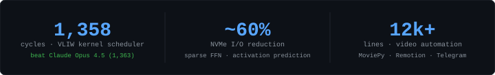

  

  
  &nbsp;
  

  

---

<h3 align="center">stack</h3>

  

---

<h3 align="center">projects</h3>

 

**[anthropic-kernel-challenge](https://github.com/amadeobonde/anthropic-kernel-challenge)**

Optimized Anthropic's VLIW SIMD scheduler to **1,358 cycles** — landing at rank 148 of 391 and beating Claude Opus 4.5 (1,363). Approach: DAG-based instruction scheduling, WAR hazard elimination, and vectorized SIMD batching.

`C++` `CUDA` `SIMD`

 

---

**[HerbLens](https://github.com/amadeobonde/HerbLens)**

iOS plant identification app — photograph a herb, get an instant AI ID, health score against your goals, contraindication warnings, and step-by-step tea & tincture recipes. Premium tier via RevenueCat.

SwiftUI · Supabase · Deno edge functions · Gemini 2.5 Flash vision + Claude chat · iOS 26 Liquid Glass

`Swift` `TypeScript` `Supabase`

 

---

**[devexana-reels](https://github.com/amadeobonde/devexana-reels)**

Automated Instagram Reels pipeline — 6 video formats generated per clip, Gemini AI captions, multi-pass quality gate, Telegram review bot for approval before publish. 12k+ lines, fully headless.

`Python` `TypeScript` `MoviePy` `Remotion`

 

---

**[jetson-inference](https://github.com/amadeobonde/jetson-inference)**

LLM inference engine for Jetson Orin Nano. Streams quantized weights directly off NVMe to GPU via `io_uring` zero-copy I/O — cutting memory overhead vs loading full model into RAM. Custom CUDA kernels, sparse FFN with activation prediction cuts I/O by ~60%.

`Python` `C++` `CUDA` `io_uring`

---

**[podcastbrief](https://github.com/amadeobonde/podcastbrief)**

Spotify podcast playlist → morning-brief PDFs + an Obsidian-style notes vault you can query from Telegram. Whisper transcription, local Gemma 4 E4B via Ollama — zero cloud API cost after setup.

`Python` `Ollama` `Whisper`

---

  

